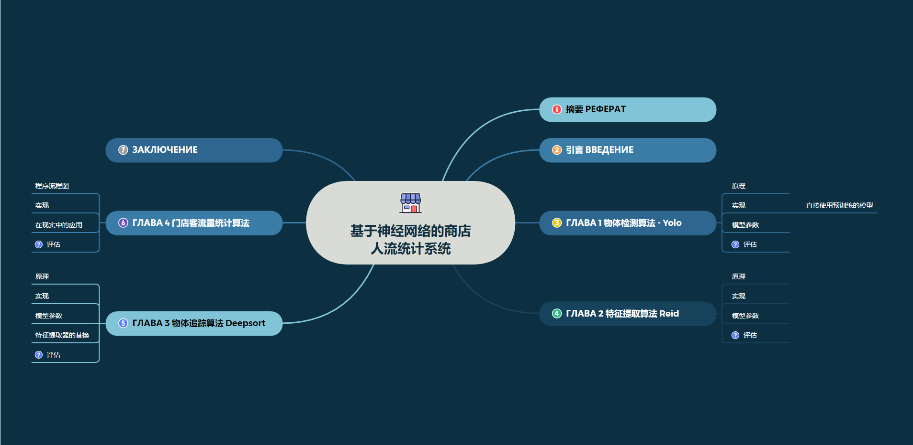

# 2023-Graduation-Project-PeopleTrafficAnalize
2023 Graduation Project: A store traffic analysis system based on pytorch and opencv



Implementation plan and its block diagram:

1. Use OpenCV to capture the video stream, and preprocess each frame of the stream, including operations such as cropping, scaling, and normalization.
2. Use a pedestrian detection algorithm (such as HaarCascade or a deep learning-based object detector) to detect pedestrians in the preprocessed image, and extract the ROI (Region of Interest) of the pedestrian.
3. To perform feature extraction on each extracted pedestrian ROI, a pre-trained convolutional neural network (such as ResNet) can be used to extract the pedestrian feature vector.
4. The extracted feature vectors are clustered, and similar feature vectors are classified into the same category, that is, the same pedestrians are identified.
5. According to the position and time information of each pedestrian in the video sequence, the indicators such as the time of entry and exit of each pedestrian and the time of staying in the store are calculated.
6. Save the calculated indicators to the database or file for subsequent analysis and statistics.

```
+------------------------------+
|  Capture the video stream    |
+-------+----------------------+
        |
        v
+-----------------------------------------+
|   Preprocess each frame of the stream   |
+-------+---------------------------------+
        |
        v
+-----------------------------+
|   Face Detection (YOLO)     |
+-----------------------------+
        |
        | (ROI of each person)
        |
        v
+------------------------------------+
|  Feature Extraction and Clustering |
+-------+----------------------------+
        |
        v
+-----------------------+
| Record In and out time|
+-------+---------------+
        |
        v
+--------------------+
|    Data Storage    |
+--------------------+
```

### PROBLEM
The same person will appear in both video streams, and methods based on facial recognition can be used to determine that it is the same person. 

【How to do face recognition algorithm based on two video streams?】
#### Solution 1:
        1. All face regions are detected and extracted in each video stream.
        2. For each face region, use a face recognition algorithm (such as FaceNet) to convert it into a fixed-length feature vector.
        3. All the face feature vectors extracted from the two video streams are stored in a database, and the corresponding personal identity information is marked for each feature vector.
        4. When a new face area is detected, it is converted into a feature vector using the same face recognition algorithm and compared with all feature vectors stored in the database.
        5. If it is found that there is already a feature vector very similar to the current face feature vector in the database, it means that the current face may belong to a person who has been recognized, and it can be classified under the identity of the person.


---


План реализации и его блок-схема:

1. Используйте OpenCV для захвата видеопотока и предварительной обработки каждого кадра потока, включая такие операции, как обрезка, масштабирование и нормализация.
2. Используйте алгоритм обнаружения пешеходов (например, HaarCascade или детектор объектов на основе глубокого обучения), чтобы обнаружить пешеходов на предварительно обработанном изображении и извлечь ROI (область интереса) пешехода.
3. Чтобы выполнить извлечение признаков для каждой извлеченной пешеходной области интереса, можно использовать предварительно обученную свёрточную нейронную сеть (например, ResNet) для извлечения вектора признаков пешеходов.
4. Извлеченные векторы признаков группируются, и похожие векторы признаков классифицируются в одну и ту же категорию, то есть идентифицируются одни и те же пешеходы.
5. По информации о положении и времени каждого пешехода в видеоряде рассчитываются такие показатели, как время входа и выхода каждого пешехода и время пребывания в магазине.
6. Сохраните рассчитанные показатели в базу данных или файл для последующего анализа и статистики.

```
+--------------------+
| Захват видеопотока |
+-------+------------+
         |         
+-----------------------------------------------+
| Предварительно обработайте каждый кадр потока |
+---------------------+-------------------------+
         |         
+--------------------------+
| Распознавание лиц (YOLO) |
+--------------------------+
         |
         | (ROI каждого человека)
         |         
+--------------------------------------+
| Извлечение признаков и кластеризация |
+-------+------------------------------+
         |         
+-------------------------------+
| Запись времени прихода и ухода|
+-------+-----------------------+
         |
         |
+-----------------+
| Хранение данных |
+-----------------+
```

